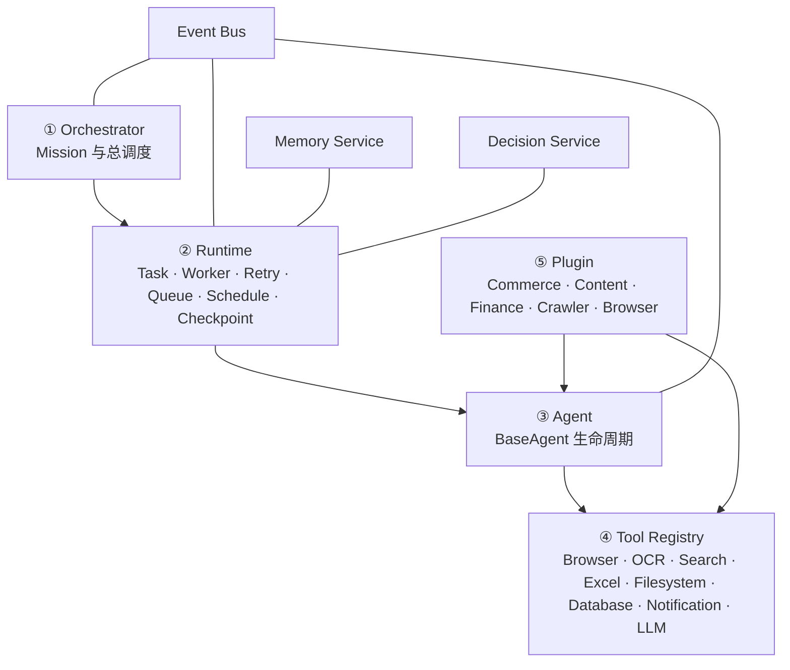
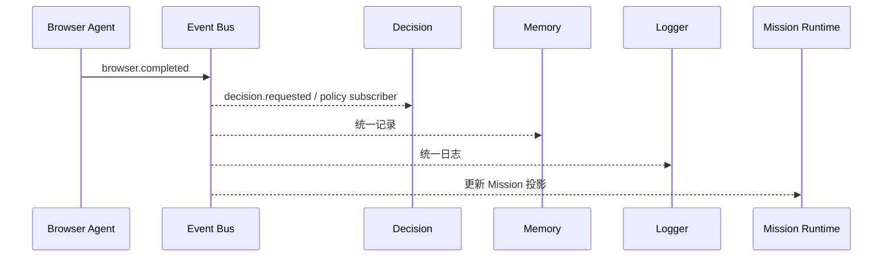

# Hammer OS Architecture Freeze No.001

Hammer OS 是 Agent Operating System。Commerce 只是在 OS 上安装的第一个 Plugin。



## 冻结边界

1. Orchestrator 只创建 Mission、调用 Planner 和 Runtime，不实例化 Agent，不调用 Tool。
2. Runtime 只通过注入的 Agent Registry 创建 Worker，不包含任何业务判断。
3. Agent 之间禁止互相调用，只能发布或订阅 Event。
4. Agent 只能通过 Tool Registry 使用 Browser、OCR、Search、Excel、Filesystem、Database、Notification、LLM。
5. 所有 Agent 统一通过 Memory Service 读写；Checkpoint 也写入统一 Memory Service。
6. Decision Service 属于 Core，只提供通用 Policy 注册与执行；业务 Policy 必须由 Plugin 注册。
7. Plugin Manager 是唯一安装入口，负责注册 Agent、Tool、Planner、Decision Policy 和 Event Subscription。
8. `src/` 是冻结的旧 Web 兼容层。其 Commerce 创建入口已经改为 Commerce Plugin 的 compatibility bridge；禁止继续向旧目录新增业务能力。

## 事件通信



## 目录

```text
hammer-os/
├── core/
│   ├── orchestrator/
│   ├── runtime/
│   ├── planner/
│   ├── memory/
│   ├── decision/
│   ├── scheduler/
│   └── eventbus/
├── agents/
│   ├── browser/
│   ├── commerce/
│   ├── content/
│   └── customer/
├── tools/
├── plugins/
│   ├── commerce/
│   ├── content/
│   ├── finance/
│   ├── crawler/
│   └── browser/
└── apps/
    ├── mobile/
    ├── web/
    └── desktop/
```

## 新 Agent 验收

新增 Finance Agent 时只需：

```js
class FinanceAgent extends BaseAgent {
  static agentType = "finance";
  async onTask(task) {
    return this.useTool("finance.calculate", task.input);
  }
}
```

然后由 Finance Plugin 注册 Agent、Tool 和 Planner。Runtime、Orchestrator、Memory、Decision、EventBus 均不需要修改。
