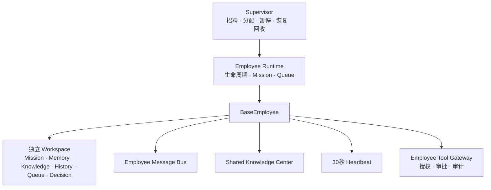
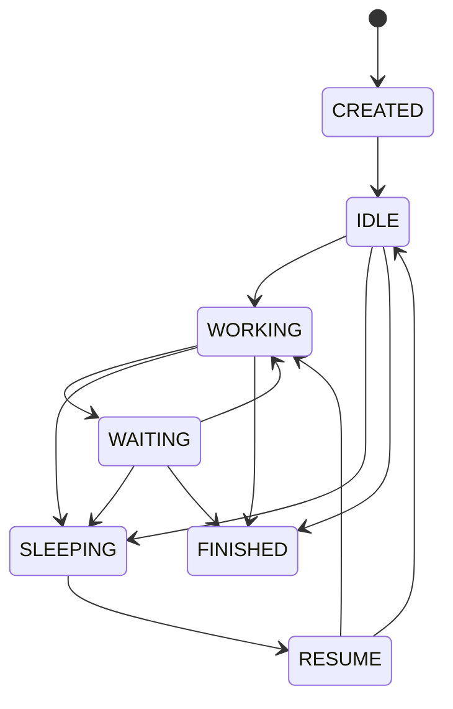
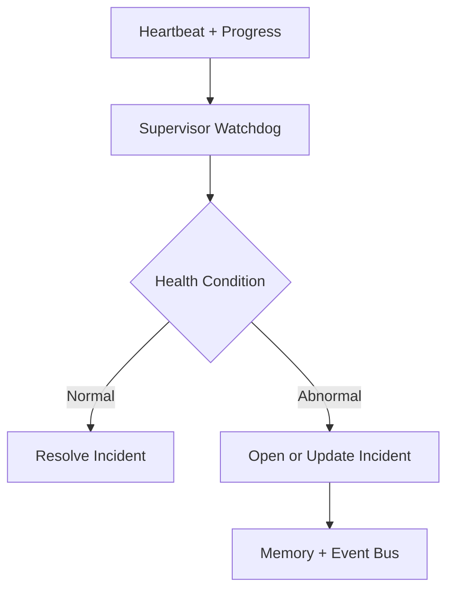
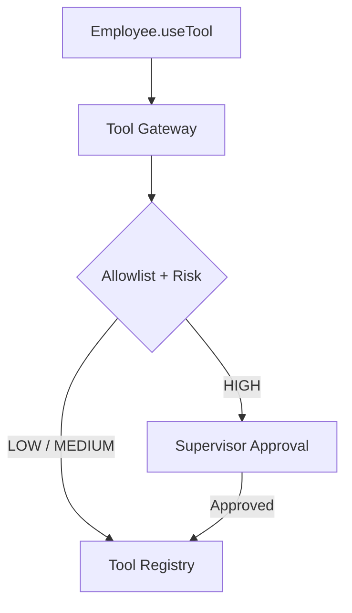
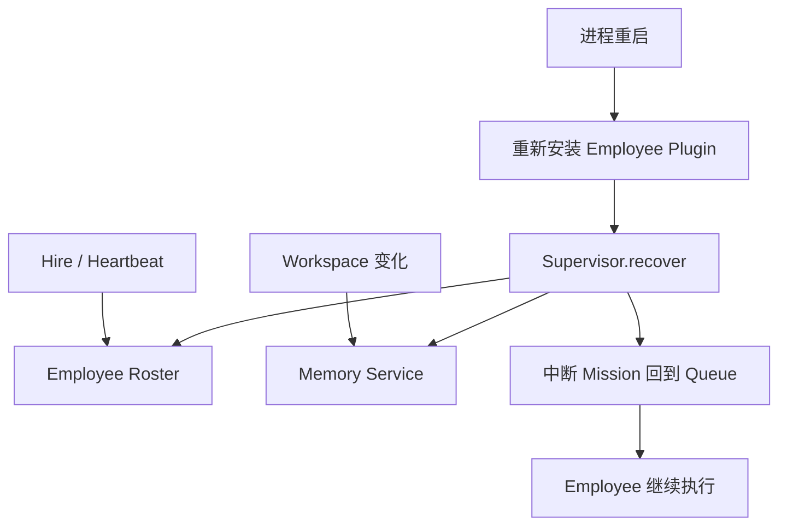

# Hammer OS Architecture Sprint 2 — Employee Framework

Hammer OS 的新核心不是某个 Commerce 功能，而是一个可以招聘、管理和协作多个数字员工的 Employee Runtime。旧 Agent/Plugin Runtime 暂时保留为兼容层，新能力统一使用 Employee 命名。



## 冻结边界

1. Supervisor 只管理 `BaseEmployee`，不导入 Commerce、Research、Finance 等具体员工。
2. 新员工只需 `class ResearchEmployee extends BaseEmployee`，不修改 Employee Runtime 或 Hammer Core。
3. Employee Context 只暴露自己的 Workspace、Message Bus、Knowledge Center 和受控 Tool Gateway；不暴露 Runtime、Memory Service 或原始 Tool Registry。
4. Employee 之间禁止持有或调用另一个 Employee 实例，协作必须发送 `EmployeeMessage`。
5. 每个 Employee 拥有独立 Workspace；共享事实统一写入 Knowledge Center。
6. Supervisor 通过 Heartbeat 和进度时间判断 `HEALTHY / WAITING / STUCK / WAITING_TOO_LONG / NEED_HELP / STALE / DEAD`。
7. Commerce 业务冻结在旧 Plugin 中。删除或不安装 Commerce Plugin 不影响 Employee Framework 启动。

## Employee Lifecycle



非法跳转会直接拒绝，例如 `CREATED → FINISHED`。正在工作的 Employee 通过 `checkpoint()` 协作式暂停，在 Supervisor 恢复后从同一任务继续。

## Employee Workspace

每次招聘都会创建独立实例：

```text
EmployeeWorkspace
├── mission
├── memory
├── knowledge
├── history
├── queue
└── decision
```

Workspace 可由统一 Memory Service 持久化，但 Employee 本身拿不到 Memory Service。

## Employee Message

```text
Research Employee
  → EmployeeMessage { from, to, type, payload, correlationId }
  → Message Bus
  → Finance Employee
  → Response Message
  → Research Employee
```

请求期间 Research Employee 自动进入 `WAITING`，收到回复后回到 `WORKING`。

## Heartbeat

默认每 30 秒上报：

```json
{
  "message": "I'm Alive",
  "employeeId": "research-1",
  "state": "WORKING",
  "currentMission": { "id": "mission-1" },
  "progress": 55,
  "waiting": null,
  "needHelp": false
}
```

Supervisor 保存最后心跳和最后进度变化时间。90 秒没有心跳标为 `STALE`，180 秒标为 `DEAD`；正在执行 Mission 但进度长时间不变标为 `STUCK`，等待超时标为 `WAITING_TOO_LONG`，员工主动求助标为 `NEED_HELP`。

## Supervisor Watchdog

Watchdog 默认每 30 秒检查在职 Employee。异常发生时写入 `employee.incidents`，并发布 `employee.supervisor.incident` Event；同一 Employee 的同一异常只保留一个打开事件。心跳和进度恢复后，事件改为 `RESOLVED`并发布关闭 Event。



Watchdog 不写任何 Commerce 规则，也不直接代替 Employee 做业务决策。

## Employee Tool Gateway

Employee 不能直接保存 Tool Registry。`BaseEmployee.useTool()` 只能访问 Employee Context 内的受控 Gateway。



- 默认权限为空，未声明的 Tool 直接拒绝。
- Employee 通过 `static allowedTools = ["public.search"]` 声明工具白名单。
- 也可以使用 `TYPE:BROWSER` 授权某个 Tool Type。
- `HIGH` 风险工具自动进入审批队列，Employee Lifecycle 进入 `WAITING`。
- 审批记录写入 `employee.tool-approvals`；密码、Token、API Key、Cookie 等字段持久化前自动脱敏。
- 重启后旧的 `PENDING` 请求自动转为 `EXPIRED`，避免误执行。

## Knowledge Center

共享类别固定为：

- `rules`
- `market`
- `platform`
- `experience`

每条知识保留作者、来源和更新时间。Research 写入后，Finance、Commerce 或未来 Employee 可直接读取，不重复学习。

## 目录

```text
hammer-os/employees/
├── core/
│   ├── base-employee.js
│   ├── employee-context.js
│   ├── employee-lifecycle.js
│   └── employee-state.js
├── runtime/
│   └── employee-runtime.js
├── supervisor/
│   └── supervisor.js
├── workspace/
│   └── employee-workspace.js
├── communication/
│   └── employee-message-bus.js
├── heartbeat/
│   └── employee-heartbeat-monitor.js
├── tools/
│   ├── employee-tool-gateway.js
│   └── employee-tool-approval-service.js
├── knowledge/
│   └── knowledge-center.js
└── index.js
```

## 新 Employee 验收

```js
class ResearchEmployee extends BaseEmployee {
  static employeeType = "research";

  async execute(mission) {
    this.reportProgress(50, "researching");
    return { missionId: mission.id, finding: "done" };
  }
}

const hammer = createHammerOS();
const research = await hammer.supervisor.hire(ResearchEmployee);
await hammer.supervisor.assign(research.id, { goal: "研究公开市场" });
```

不需要修改 Core、Runtime、Supervisor 或 Message Bus。

## Employee Plugin

通用 Plugin Contract 支持 `employees`：

```js
definePlugin({
  manifest: { id: "research", version: "1.0.0" },
  employees: [ResearchEmployee],
});
```

Plugin Manager 只把 Employee 类型注册到 Supervisor，不实例化业务员工。Supervisor 使用 `hireByType("research")` 招聘。

## Process Recovery



Roster 保存 Employee 类型、Plugin 来源、状态与 Lifecycle 快照；Workspace 保存私人 Memory、Knowledge 引用、History、Queue 和 Decision。已回收员工不会恢复；缺失 Employee Plugin 时返回 `MISSING_EMPLOYEE_PLUGIN`，不会生成错误实例。
